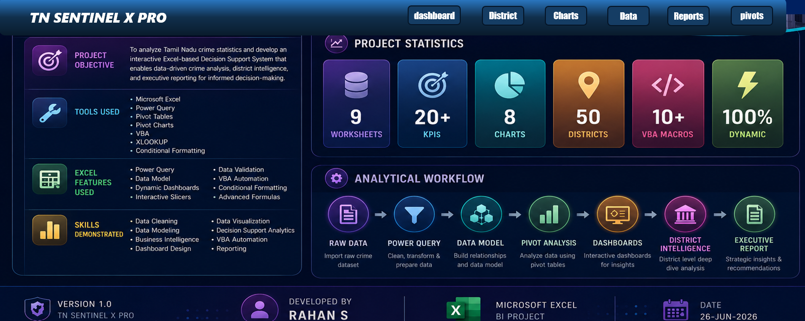
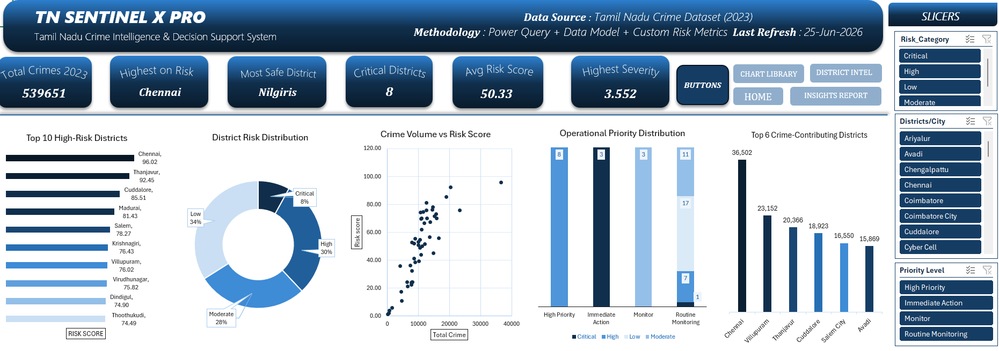
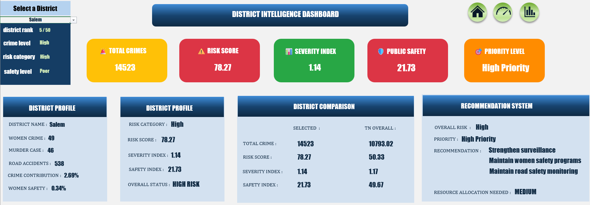
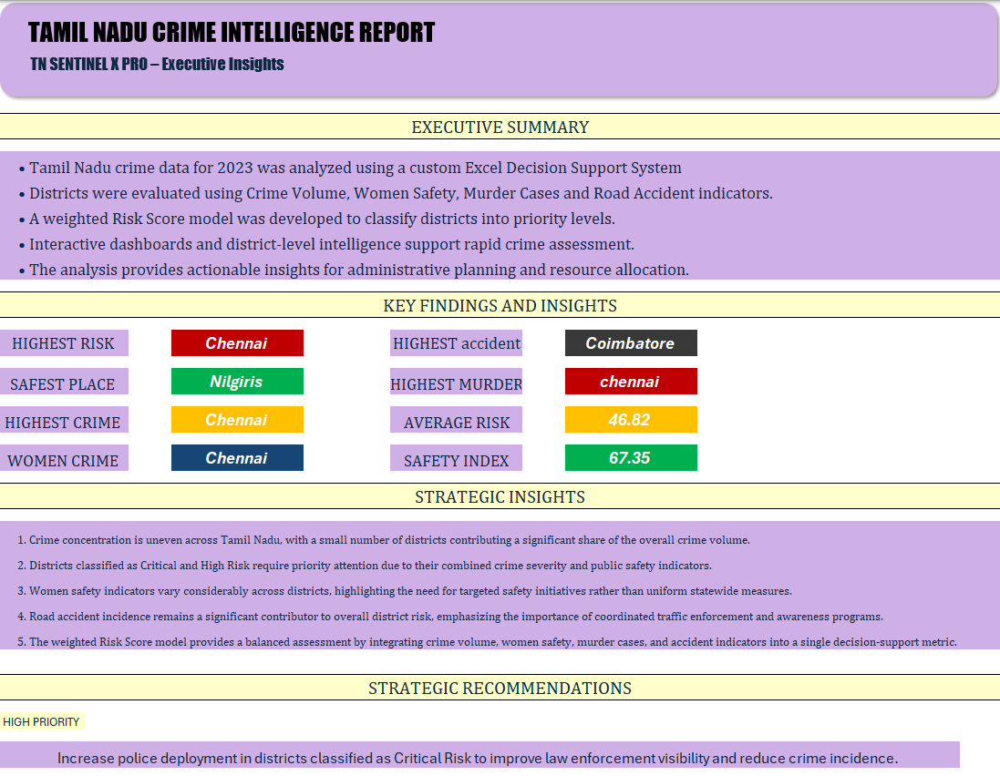
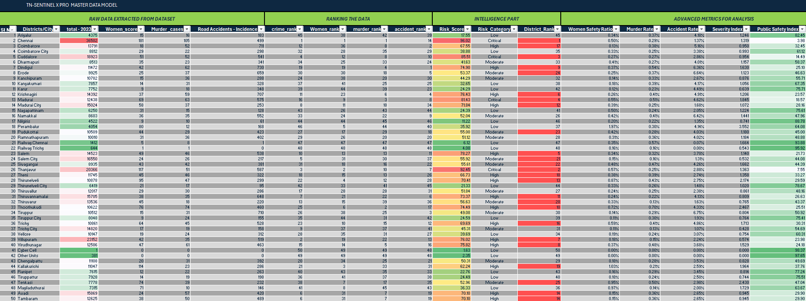
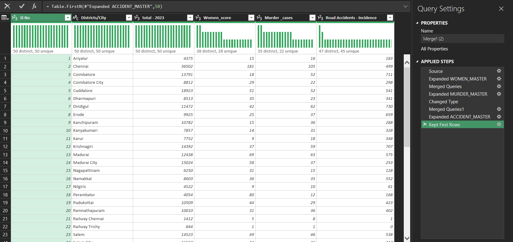
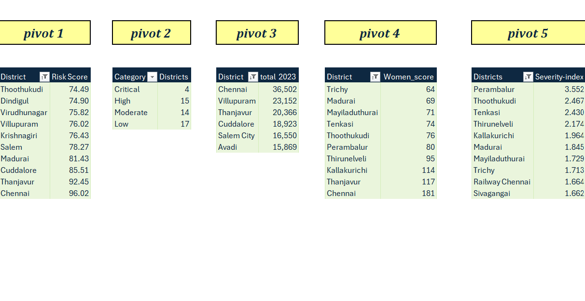
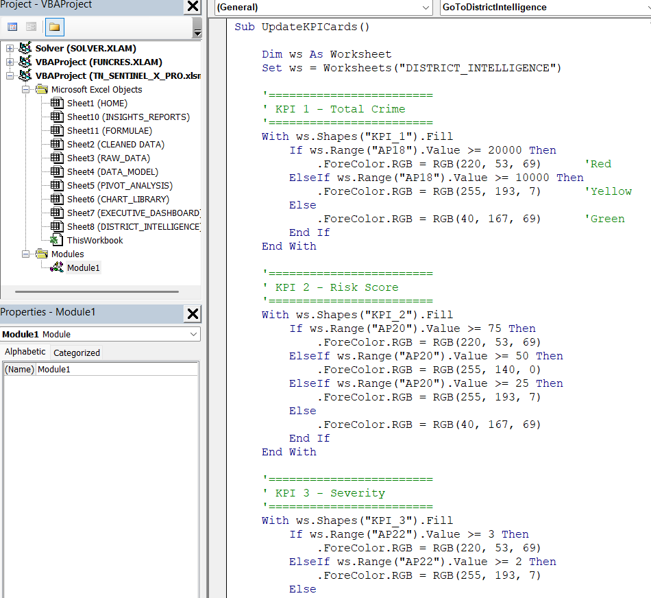

<div align="center">

# 🛡️ TN SENTINEL X PRO

### Tamil Nadu Crime Intelligence & Decision Support System

### 🚔 Transforming Raw Crime Data into Actionable Intelligence using Microsoft Excel



<br>


---

**A Professional Business Intelligence & Decision Support System built entirely in Microsoft Excel**

Designed to analyze Tamil Nadu Crime Statistics using **Power Query, Data Modeling, Pivot Tables, Interactive Dashboards, VBA Automation, and Executive Reporting.**

⭐ If you like this project, consider giving it a star!

</div>

---

# 📑 Table of Contents

- [Project Overview](#-project-overview)
- [Project Objectives](#-project-objectives)
- [Key Features](#-key-features)
- [Business Problem](#-business-problem)
- [Analytical Workflow](#-analytical-workflow)
- [System Architecture](#-system-architecture)
- [Project Structure](#-project-structure)
- [Technologies Used](#-technologies-used)

---

# 📖 Project Overview

TN SENTINEL X PRO is a complete **Business Intelligence (BI)** and **Decision Support System (DSS)** developed entirely in Microsoft Excel.

The project demonstrates how Excel can be transformed into a powerful analytical platform capable of:

- Cleaning raw datasets
- Building analytical data models
- Creating dynamic KPIs
- Performing district-level intelligence analysis
- Developing interactive dashboards
- Automating workflows using VBA
- Producing executive-level reports

Unlike traditional Excel dashboards, TN SENTINEL X PRO follows a complete Business Intelligence workflow similar to enterprise BI solutions.

---

# 🎯 Project Objectives

The primary objective of this project is to build a professional Business Intelligence system capable of transforming raw crime statistics into meaningful insights for strategic decision-making.

### Objectives

✔ Analyze Tamil Nadu Crime Statistics (2023)

✔ Clean and transform raw datasets using Power Query

✔ Develop an analytical Data Model

✔ Create custom crime intelligence metrics

✔ Perform interactive district-level analysis

✔ Develop executive dashboards

✔ Generate strategic insights and recommendations

✔ Demonstrate Excel automation using VBA

---

# 📸 Project Showcase


## 📊 Executive Dashboard

The Executive Dashboard provides a statewide overview of crime statistics through interactive KPIs, charts, and slicers.

<p align="center">

</p>

### Dashboard Highlights

- 📈 Total Crimes
- ⚠ Highest Risk District
- 🟢 Safest District
- 📊 Average Risk Score
- 🚨 Critical District Analysis
- 📉 Crime Distribution
- 🎯 Operational Priority Distribution
- 🏆 Top Crime Contributing Districts
- 🎛 Interactive Slicers

---

## 🏛 District Intelligence Dashboard

District Intelligence enables users to perform district-level analysis using a dynamic district selector.

<p align="center">

</p>

### Intelligence Features

- District Profile
- Crime Profile
- Risk Assessment
- Public Safety Analysis
- Severity Analysis
- District Comparison
- Recommendation Engine
- Dynamic KPI Cards
- VBA-based Color Automation

---

## 📄 Executive Insights Report

The Executive Report summarizes key findings and converts analytical results into strategic recommendations for decision-makers.

<p align="center">

</p>

### Report Includes

- Executive Summary
- Key Findings
- Strategic Insights
- Strategic Recommendations
- Project Conclusion

---

## 📋 Analytical Data Model

A custom analytical model was developed to transform raw crime statistics into meaningful business metrics.

<p align="center">

</p>

### Calculated Metrics

| Metric | Purpose |
|---------|---------|
| Risk Score | Overall district risk assessment |
| Risk Category | Classifies districts into Critical, High, Moderate and Low |
| District Rank | Statewide district ranking |
| Women Safety Ratio | Women crime relative to total crime |
| Murder Rate | Murder cases relative to total crime |
| Accident Rate | Road accident contribution |
| Severity Index | Combined crime severity indicator |
| Public Safety Index | Overall district safety measurement |
| Crime Contribution % | District contribution to statewide crime |
| Priority Level | Administrative priority classification |

---

## 🔄 Power Query

Power Query was used for data cleaning, transformation, merging datasets, and preparing the analytical model.

<p align="center">

</p>

### Data Preparation Steps

- Import Raw Dataset
- Merge Queries
- Expand Tables
- Standardize Data Types
- Clean Missing Values
- Build Final Analytical Table

---

## 📊 Pivot Analysis

Pivot Tables serve as the analytical engine behind the dashboards.

<p align="center">

</p>

The Pivot Analysis sheet enables:

- Top Risk District Analysis
- Category Distribution
- Crime Contribution Ranking
- Women Crime Analysis
- Severity Index Ranking

---

## ⚙ VBA Automation

Custom VBA was developed to improve interactivity and user experience.

<p align="center">

</p>

### VBA Features

- Dashboard Navigation
- District Navigation
- Dynamic KPI Color Updates
- Interactive Workbook Controls

---

# 🚀 Key Features

### 📂 Data Engineering

- Import Raw Dataset
- Power Query Cleaning
- Data Transformation
- Data Validation
- Data Standardization

---

### 🧠 Analytical Model

Custom-built metrics including:

- Risk Score
- Risk Category
- District Ranking
- Women Safety Ratio
- Murder Rate
- Accident Rate
- Severity Index
- Public Safety Index
- Crime Contribution %
- Priority Level

---

### 📊 Executive Dashboard

- Dynamic KPI Cards
- Risk Distribution
- District Ranking
- Crime Contribution
- Interactive Slicers
- Scatter Analysis
- Operational Priority Analysis

---

### 🏛 District Intelligence

- District Selector
- District Profile
- Risk Assessment
- Safety Analysis
- District Comparison
- Recommendation System
- Dynamic KPI Colors
- VBA Automation

---

### 📄 Executive Reporting

- Executive Summary
- Key Findings
- Strategic Insights
- Strategic Recommendations
- Project Conclusion

---

### ⚙ Automation

- VBA Navigation
- Dynamic Shape Color Changes
- Interactive Buttons
- Workbook Protection
- User-friendly Navigation

---

# ❓ Business Problem

Crime datasets contain large volumes of information that are difficult to interpret directly.

Decision-makers require:

- Quick district comparison
- Risk prioritization
- Public safety assessment
- Executive summaries
- Strategic recommendations

TN SENTINEL X PRO addresses these challenges by transforming raw crime data into interactive visual intelligence.

---

# 🔄 Analytical Workflow

```text
                RAW DATASET
                     │
                     ▼
            POWER QUERY CLEANING
                     │
                     ▼
             DATA TRANSFORMATION
                     │
                     ▼
             ANALYTICAL DATA MODEL
                     │
                     ▼
          CALCULATED BUSINESS METRICS
                     │
                     ▼
              PIVOT TABLE ANALYSIS
                     │
                     ▼
               CHART DEVELOPMENT
                     │
                     ▼
          EXECUTIVE DASHBOARD
                     │
                     ▼
      DISTRICT INTELLIGENCE DASHBOARD
                     │
                     ▼
         EXECUTIVE INSIGHTS REPORT
```

---

# 🏗 System Architecture

```
                  RAW DATASET
                       │
                       ▼
              Microsoft Power Query
                       │
                       ▼
                Cleaned Data Model
                       │
       ┌───────────────┼───────────────┐
       ▼               ▼               ▼
 Pivot Tables     Calculated KPIs    VBA
       │               │               │
       └───────────────┼───────────────┘
                       ▼
             Interactive Dashboards
                       │
         ┌─────────────┴──────────────┐
         ▼                            ▼
Executive Dashboard       District Intelligence
                       │
                       ▼
              Executive Insights Report
```

---

# 🗂 Project Structure

```
TN-SENTINEL-X-PRO
│
├── workbook
│   └── TN_SENTINEL_X_PRO.xlsm
│
├── dataset
│   ├── raw
│   └── processed
│
├── screenshots
│
├── documentation
│
├── assets
│
├── README.md
├── LICENSE
└── .gitignore
```

---

# ⚠️ Important - First Time Setup

> **This project uses VBA macros for dashboard navigation, dynamic KPI updates, and interactive features.**
>
> Due to Microsoft's security policy, Office blocks macros in files downloaded from the internet (including GitHub). This is a standard security feature and **does not indicate any issue with the project.**

## 📥 First-Time Setup (Required Only Once)

### Step 1
Download the repository and extract it if you downloaded the ZIP version.

### Step 2
Before opening the workbook:

- Right-click **TN_SENTINEL_X_PRO.xlsm**
- Select **Properties**

### Step 3
At the bottom of the **General** tab:

✅ Check **Unblock**

Click:

**Apply → OK**

### Step 4
Now open the workbook in **Microsoft Excel**.

If prompted:

- Click **Enable Editing**
- Click **Enable Content / Enable Macros**

The workbook will now function normally with:

- ✅ Dashboard Navigation
- ✅ Interactive Buttons
- ✅ Dynamic KPI Cards
- ✅ VBA Automation
- ✅ District Intelligence Dashboard
- ✅ Executive Dashboard

---

## 🔒 Why is this required?

Microsoft automatically blocks macros in Office files downloaded from the internet to protect users from potentially malicious files.

Since this workbook contains legitimate VBA automation, Windows may mark it as an **untrusted file** until it is manually unblocked.

This is a **standard Microsoft Office security feature** and applies to most macro-enabled Excel projects shared through GitHub, OneDrive, email, or other online sources.

---

## 💡 Recommended

For the best experience, move the workbook to one of your **Trusted Locations** in Microsoft Excel after downloading. This prevents future security prompts and allows all interactive features to run seamlessly.

# 🛠 Technologies Used

| Category | Technology |
|-----------|------------|
| Platform | Microsoft Excel 365 |
| Data Cleaning | Power Query |
| Data Analysis | Pivot Tables |
| Visualization | Pivot Charts |
| Automation | VBA |
| Lookup | XLOOKUP |
| Functions | IF, IFS, INDEX, MATCH, RANK, ROUND, AVERAGE |
| UI Design | Shapes, Icons, Conditional Formatting |
| Reporting | Executive Insights Report |
| Protection | Workbook & VBA Protection |

---


# 📚 Documentation

The repository contains additional documentation.

```
documentation
│
├── User_Guide.pdf
├── Formula_Documentation.pdf
└── Project_Report.pdf
```

---

# 💡 Skills Demonstrated

### Data Analytics

- Data Cleaning
- Data Transformation
- Exploratory Data Analysis
- KPI Development

### Business Intelligence

- Dashboard Development
- Executive Reporting
- Decision Support Systems
- Interactive Reporting

### Microsoft Excel

- Power Query
- Pivot Tables
- Pivot Charts
- Advanced Formulas
- Conditional Formatting
- Data Validation
- Workbook Protection

### Programming

- VBA Automation
- Dynamic Navigation
- Event-driven Programming

---

# 🚀 Future Enhancements

- Power BI Implementation
- SQL Database Integration
- Python Analytics Pipeline
- AI-based Crime Forecasting
- Real-time Crime Monitoring
- Interactive GIS Crime Mapping
- Predictive Risk Analysis

---

# ▶ Installation & Usage

### Requirements

- Microsoft Excel 365 (Recommended)
- Macros Enabled (.xlsm)

### Steps

1. Clone or download this repository.

2. Open **TN_SENTINEL_X_PRO.xlsm**

3. Enable Macros.

4. Use the **HOME** page for navigation.

5. Explore dashboards using slicers and district selection.

---

# 📈 Project Statistics

| Feature | Count |
|-----------|-------:|
| Worksheets | 9 |
| Dashboards | 2 |
| Executive Report | 1 |
| Charts | 8+ |
| KPIs | 20+ |
| Calculated Metrics | 10 |
| VBA Modules | 1 |
| Districts Analyzed | 50 |

---

# 👨‍💻 Author

## Rahan S

**B.Tech – Artificial Intelligence & Data Science**

Passionate about:

- Business Intelligence
- Data Analytics
- Machine Learning
- Artificial Intelligence
- Dashboard Development

### Connect With Me

**GitHub**

https://github.com/rahan1506

**LinkedIn**

https://linkedin.com/in/rahans

**Email**

rahan1510s@gmail.com

---

# 📜 License

This project is licensed under the **MIT License**.

See the **LICENSE** file for details.

---

# ⭐ Support

If you found this project useful or interesting:

⭐ Star this repository

🍴 Fork the repository

📢 Share your feedback

---

<div align="center">

# 🛡 TN SENTINEL X PRO

### Tamil Nadu Crime Intelligence & Decision Support System

**Built entirely using Microsoft Excel**

Power Query • Data Modeling • Pivot Tables • VBA • Business Intelligence • Executive Reporting

---

### Thank you for visiting this repository!

⭐ **Don't forget to star the project if you liked it.**

</div>
